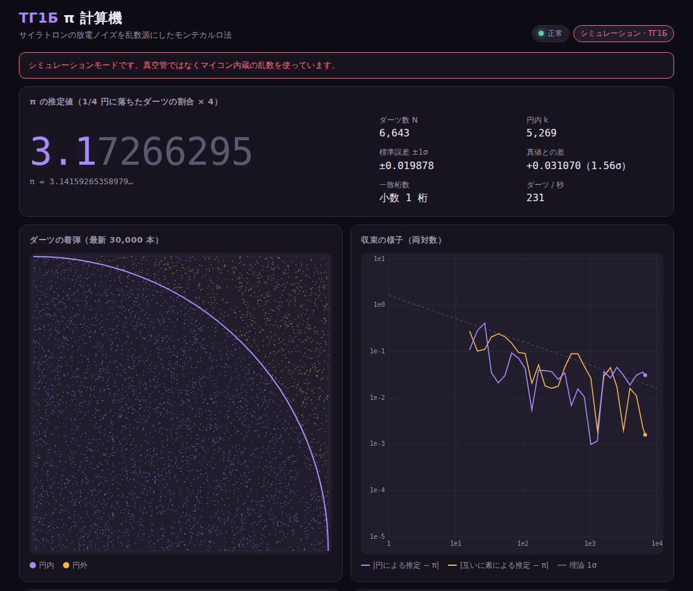

# ТГ1Б π 計算機

ソ連製のガス入り熱陰極グリッド制御整流管（サイラトロン）**ТГ1Б** の放電ノイズを乱数源にして、
モンテカルロ法で円周率を求めるファームウェアです。マイコンが Wi-Fi アクセスポイントになり、
スマートフォンで接続するとキャプティブポータルとして計算の様子がリアルタイムに表示されます。

対応ボード: **Seeed Studio XIAO ESP32C3** / **Raspberry Pi Pico 2 W**



## 仕組み

```
ТГ1Б の放電ノイズ ─▶ 増幅 ─▶ ADC ─┐
       または                        ├─▶ 健全性テスト ─▶ ビット化 ─▶ フォン・ノイマン抽出 ─▶ 32 bit 語
点弧タイミングの揺らぎ ─▶ GPIO 割込 ─┘   (SP 800-90B)                                    │
                                                                  ┌──────────────────────┴───────┐
                                                             偶数番目の語                      奇数番目の語
                                                        (x, y) ∈ [0,65536)²                  a, b ∈ [1,65536]
                                                        x²+y² < r² の割合 × 4 ≈ π             gcd(a,b)=1 の割合 = 6/π²
                                                                  └──────────────┬───────────────┘
                                                         Wi-Fi AP + DNS 横取り + Web サーバー ─▶ スマートフォン
```

1. **取り込み** — アナログ方式では放電中の雑音電圧を ADC で読み、パルス方式では弛張発振の点弧間隔を
   割込みで計ります。
2. **健全性テスト** — NIST SP 800-90B 4.4 節の反復回数テストと適応比率テストを生サンプルにかけ、
   失敗したらしばらくビットを捨てます。さらに雑音の標準偏差が閾値を下回ったら（管が放電していないなど）
   「ノイズ不足」としてビットを捨てます。
3. **ビット化と偏り除去** — アナログはサンプルが移動平均より上か下か、パルスは隣り合う間隔の大小で 1 ビットを作り、
   フォン・ノイマン抽出器で 0/1 の偏りを取り除きます。
4. **円周率の推定** — 32 ビット語を交互に 2 つの推定に振り分けます。
   - 単位正方形に投げたダーツが 1/4 円に入る割合 × 4
   - 2 つの整数が互いに素になる確率が 6/π² であることを使った推定
5. **表示** — マイコンは SoftAP になり、すべての DNS 問い合わせに自分の IP を返します。
   スマートフォンの OS が接続確認用 URL にアクセスすると 302 で画面に誘導されるので、
   接続するだけでアプリが開きます。

モンテカルロ法の誤差はダーツ数 N に対して約 1.64/√N なので、小数 1 桁増やすには 100 倍のダーツが要ります。
毎秒 250 本なら、小数 2 桁（誤差 0.005 未満、約 10 万本）に 10 分弱、3 桁（約 1000 万本）には半日ほどかかります。
真空管の雑音がどれだけ「理想的な乱数」に近いかは、誤差が理論曲線 1.64/√N に沿って減っていくかで確かめられます。

## 画面の見方

| カード | 内容 |
| --- | --- |
| π の推定値 | 真値と一致している桁を光らせて表示。±1σ と真値との差（何 σ ずれているか） |
| ダーツの着弾 | 直近 30,000 本の散布図。紫が円内、橙が円外 |
| 収束の様子 | ダーツ数と誤差の両対数グラフ。点線が理論上の 1σ |
| 互いに素による推定 | もう一つの独立な推定値 |
| エントロピー抽出 | 生ビット/出力ビットの速度、1 の比率、系列相関 |
| ノイズ源 | 生サンプルの波形とヒストグラム、σ、最小エントロピー（MCV 推定） |
| 健全性テスト | 各テストの閾値と失敗回数 |
| 操作 | 推定のリセット、直近 4 KiB の乱数のダウンロード |

## ハードウェア

**必ず先に [docs/hardware.md](docs/hardware.md) を読んでください。** 高電圧の扱い、ТГ1Б のピン配置、
2 つの入力方式の回路構成、レベル合わせの手順、乱数が本当に真空管から来ているかの確認方法を書いています。

| 信号 | XIAO ESP32C3 | Pico 2 W |
| --- | --- | --- |
| アナログ入力 | D1（GPIO3） | GP26（ADC0） |
| パルス入力 | D3（GPIO5） | GP15 |

## ビルドと書き込み

### PlatformIO

```sh
pio run -e xiao_esp32c3 -t upload        # XIAO ESP32C3・アナログ方式
pio run -e pico2w -t upload              # Pico 2 W・アナログ方式
pio run -e xiao_esp32c3_pulse -t upload  # パルス方式（pico2w_pulse も同様）
pio run -e xiao_esp32c3_sim -t upload    # 真空管なしの動作確認（マイコン内蔵乱数を使う）
pio device monitor
```

`web/index.html` はビルド前に `tools/embed_web.py` が gzip 圧縮して `src/generated/index_html.h` に埋め込みます。

### arduino-cli

esp32 コア（3.x）と arduino-pico コア（6.x）を入れた環境で:

```sh
tools/build_arduino_cli.sh esp32c3 analog -p /dev/ttyACM0 -u
tools/build_arduino_cli.sh pico2w pulse
```

第 1 引数がボード（`esp32c3` / `pico2w`）、第 2 引数が入力方式（`analog` / `pulse` / `simulated`）、
残りはそのまま `arduino-cli compile` に渡します。ビルドフラグは環境変数で渡します（例: `TUBEPI_FLAGS='-DTUBEPI_HV_ENABLE_PIN=4' tools/build_arduino_cli.sh esp32c3 analog`）。

## 使い方

1. ヒーターを点けて予熱してから陽極電源を入れます（`TUBEPI_HV_ENABLE_PIN` を使えば自動化できます）。
2. スマートフォンで Wi-Fi **`TG1B-PI`** に接続します。
   - Android: 「ネットワークにログイン」の通知をタップ
   - iPhone: 自動で開くシートに表示されます。閉じるときは「キャンセル」→「インターネットなしで使用」
   - 開かないときはブラウザで `http://192.168.4.1/` を開きます
3. 状態が「正常」になるとダーツが飛び始めます。「ノイズ不足」ならレベル合わせを見直してください。

## 設定（ビルドフラグ）

| マクロ | 既定値 | 内容 |
| --- | --- | --- |
| `TUBEPI_SOURCE` | `0` | 0 = アナログ、1 = パルス、2 = シミュレーション |
| `TUBEPI_AP_SSID` | `"TG1B-PI"` | アクセスポイント名 |
| `TUBEPI_AP_PASSWORD` | `""` | 8 文字以上で WPA2、空ならオープン |
| `TUBEPI_AP_CHANNEL` | `6` | Wi-Fi チャンネル |
| `TUBEPI_ANALOG_DECIMATION` | `4` | 何サンプルに 1 回ビットを取るか（相関対策） |
| `TUBEPI_ANALOG_BITS_LSB` | `0` | 1 にすると閾値比較ではなく ADC の最下位ビットを使う |
| `TUBEPI_PULSE_BITS_LSB` | `0` | 1 にすると間隔比較ではなく間隔の最下位ビットを使う |
| `TUBEPI_VON_NEUMANN` | アナログ 1 / パルス 0 | フォン・ノイマン抽出の有無 |
| `TUBEPI_ASSUMED_ENTROPY` | アナログ 2.0 / パルス 1.0 | 健全性テストの閾値計算に使う 1 サンプルあたりのエントロピー |
| `TUBEPI_QUIET_SIGMA` | アナログ 4.0 / パルス 2.0 | これ未満の σ は「ノイズ不足」としてビットを捨てる |
| `TUBEPI_MONITOR_WINDOW` | アナログ 16384 / パルス 1024 | σ・エントロピーを集計するサンプル数 |
| `TUBEPI_PULSE_MIN_GAP_US` | `20` | これより短いパルス間隔はチャタリングとして無視 |
| `TUBEPI_PULSE_RANGE_US` | `20000` | パルス間隔ヒストグラムの初期表示範囲 |
| `TUBEPI_HV_ENABLE_PIN` | `-1` | 陽極電源イネーブル出力（-1 で無効） |
| `TUBEPI_WARMUP_MS` | `30000` | 起動からイネーブル出力を HIGH にするまでの時間 |
| `TUBEPI_ANALOG_PIN` / `TUBEPI_PULSE_PIN` | ボードごと | 入力ピン |

## HTTP API

| パス | 内容 |
| --- | --- |
| `GET /` | アプリ本体（gzip） |
| `GET /api/state` | 状態の JSON。`s` = 受信済みダーツ数、`h` = 受信済み履歴行数、`e` = エポック、`w=1` で波形を含める、`m` = 1 回に返す点の上限（最大 512） |
| `POST /api/reset` | 推定をリセット（エポックが 1 増える） |
| `GET /random.bin` | 直近 4 KiB の出力乱数 |
| その他 | 自分宛てでないホスト名や未知のパスは `http://192.168.4.1/` へ 302 リダイレクト |

## 開発

```sh
tools/run_tests.sh
```

コアライブラリ（`lib/tubepi`）はハードウェアに依存しないヘッダのみのライブラリで、PC 上でテストできます。
テストでは NIST の閾値計算、健全性テストの失敗検出、フォン・ノイマン抽出の偏り除去、
格子化による π の偏りが 10⁻⁴ 未満であること、パルス方式のビット化、JSON の妥当性などを確認しています。

同じスクリプトでホスト用エミュレータもビルドされます。実機なしで Web 画面を確認できます。

```sh
/tmp/tubepi-tests/host_emulator --web web/index.html            # http://127.0.0.1:8080/
/tmp/tubepi-tests/host_emulator --web web/index.html --pulse --rate 2000 --sigma 25
```

## ディレクトリ構成

```
lib/tubepi/src/   ハードウェア非依存のコア（健全性テスト、ノイズ監視、抽出、π 推定、JSON）
src/              ファームウェア（ボード差分、取り込み、キャプティブポータル、main）
web/index.html    Web アプリ（外部リソースなしの単一ファイル）
tools/            埋め込みスクリプト、ビルドスクリプト、ホスト用エミュレータ
tests/            PC で動くテスト
docs/             ハードウェア接続ガイド
```
