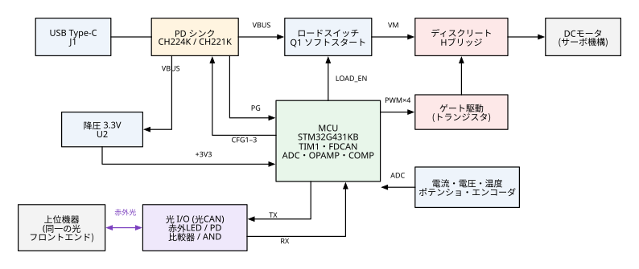

# USB PD 給電・光 CAN 入力 サーボ制御基板 設計書

型式（仮）：**PDOS-01**　／　版：0.1（試作前設計）　／　作成日：2026-09-25

---

## 1. 目的と要求仕様

| 項目 | 要求 | 本設計での実現方法 |
|---|---|---|
| 電源 | USB Type-C / USB PD から受電 | PD シンクコントローラ **CH224K**（標準）または **CH221K**（組立オプション） |
| モータ駆動 | 専用モータドライバ IC を使わない | Nch/Pch コンプリメンタリ MOSFET と汎用トランジスタによる**ディスクリート H ブリッジ**と**ディスクリート ゲート駆動** |
| 制御対象 | サーボモータ | ブラシ付き DC モータ＋位置センサ（ポテンショメータまたはエンコーダ）を MCU で位置制御する「DC サーボ」 |
| 入力 | SPI または CAN を応用した赤外 LED＋フォトダイオードの光 I/O | **CAN（ISO 11898-1 クラシック CAN）のデータリンク層を、光の物理層に載せた「光 CAN」**。890 nm 赤外 LED と PIN フォトダイオードを使う |
| 文書 | データシートに I/O 仕様を記載 | `PDOS-01_データシート.pdf`（本書と同じ内容の要約版と I/O 仕様） |

> **解釈について**：「サーボモータ」は、PWM 信号で指令する RC サーボ（モータドライバを内蔵）ではなく、**DC モータと位置センサを組み合わせて本基板が位置制御を行う構成**と解釈した。RC サーボを駆動したいだけなら、MCU の PWM 出力と 5〜6 V 電源で足り、H ブリッジは不要になる（§12 に代替案を示す）。

### 1.1 SPI ではなく CAN を採用した理由

| 観点 | SPI 応用 | **CAN 応用（採用）** |
|---|---|---|
| 必要な光チャネル数 | SCK・MOSI・CS（＋MISO）で 3〜4 本 | 送受 1 本ずつ（計 2 本） |
| クロック | 光でクロックを送るため、チャネル間のスキューが問題になる | NRZ＋ビットスタッフィングで受信側が同期するため、クロックは不要 |
| 誤り検出 | 独自に実装する必要がある | CRC-15・ACK・エラーフレーム・自動再送をハードウェアで処理 |
| 複数ノード | CS 線の本数だけ光チャネルが要る | ID による調停を使い、光スターハブで多ノード化できる |
| MCU 実装 | 汎用 SPI を使う | FDCAN ペリフェラルをそのまま使う（CAN トランシーバの代わりに光フロントエンドを置く） |

CAN のドミナント／レセッシブは、そのまま「**光 ON／光 OFF**」に割り当てられる。レセッシブ（アイドル）時は消灯になるので、光路が遮断されたり LED が故障したりしても「バスがレセッシブに張り付く」だけで済み、バスがドミナントに固着して全体を止めることはない。

---

## 2. ブロック図



| ブロック | 主要部品 | 役割 |
|---|---|---|
| USB PD 受電 | J1, U1 CH224K（または U1B CH221K） | 9/12/15/20 V を要求・受電する |
| 3.3 V 電源 | U2 AP63203WU（降圧） | VBUS 5〜20 V から +3V3 をつくる。PD 交渉前の 5 V でも動作する |
| ロードスイッチ | Q1 AO4407A, Q2 | PD 交渉の成立を確認したあと、モータ電源 VM を**ソフトスタート**で投入する |
| H ブリッジ | Q4, Q11 DMC4040SSD（N+P） | モータを正転・逆転・ブレーキ・惰性の各状態で駆動する |
| ゲート駆動 | Q5〜Q10, Q12〜Q17（汎用 Tr） | 3.3 V ロジックからゲートを駆動するレベルシフトとトーテムポール |
| MCU | U3 STM32G431KBT6 | TIM1 相補 PWM＋デッドタイム、FDCAN、ADC、内蔵 OPAMP/COMP による過電流遮断 |
| 光 I/O | D9 TSHF5210, D10 BPV10NF, U4〜U6 | CAN の物理層を光に置き換える |

---

## 3. 電源部


### 3.1 USB PD シンク（CH224K 標準実装）

* **VDD 供給**：VBUS → R1（1 kΩ, 2010, 0.75 W）→ VDD_PD、C3 1 µF。CH224K の VDD は内部で約 3.3 V に保たれる（最大 3.6 V）。20 V 受電時の R1 損失は (20−3.3)²/1k ≒ 0.28 W なので、2010 サイズ（0.75 W）を使う。
* **要求電圧の設定（レベル設定モード）**：CFG1〜3 を MCU（PB5/PB7/PA6）から R5〜R7（100 Ω）を介して直接駆動する。

  | 要求電圧 | CFG1 | CFG2 | CFG3 |
  |---|---|---|---|
  | 5 V | 1 | – | – |
  | 9 V | 0 | 0 | 0 |
  | 12 V | 0 | 0 | 1 |
  | **15 V（既定）** | 0 | 1 | 1 |
  | 20 V | 0 | 1 | 0 |

  CFG2/CFG3 の入力電圧は 3.7 V を超えてはならない。MCU の 3.3 V 出力で駆動するので、この条件は満たされる。
* **既定電圧を 15 V にした理由**：USB PD 3.0 の電力ルールでは、ソースが必ず提供するのは 5/9/15/20 V で、**12 V は任意**である。12 V を出さない充電器が多いため、15 V を既定とし、MCU が 15 → 20 → 12 → 9 V の順に交渉を試す（パラメータで変更可）。モータの定格電圧は PWM デューティの上限（`MOTOR_RATED_mV / VM`）で合わせる。
* **MCU 起動前の CFG**：リセット直後の MCU ピンは Hi-Z なので、CH224K は CFG1 を「NC」とみなして 20 V を要求する可能性がある。ただし、MCU は +3V3 の立ち上がりから数 ms で CFG を確定させる。これに対し、ソースが Source_Capabilities を送るのは接続後 100 ms 以上経ってからであり、実際に問題になることはほぼない。仮に一時的に 20 V を受電しても、**VBUS 側の部品はすべて 20 V に耐える定格で選んである**。また、この時点ではロードスイッチが OFF なのでモータには電圧がかからない。
* **固定電圧運用**：MCU で電圧を切り替えない場合は、R2（CFG1–GND）に 24 kΩ（12 V）または 56 kΩ（15 V）を実装し、PB5 は Hi-Z のままにする（抵抗設定モード）。
* **PG**：オープンドレインで、交渉が成立すると L になる。R9 で +3V3 にプルアップし、PB4 で読む。同時に D2（PD OK LED）が点灯する。
* **D+/D−**：J1 の D+/D− を U1 の DP/DM に接続する。PD 非対応の急速充電器に対しても、CH224K 側のプロトコル（BC1.2 等）で電源を取れる。

### 3.2 CH221K（組立オプション B）

U1 の代わりに U1B（SOT-23-6）を実装し、R8 を CFG–VDD_PD 間に実装する。R5〜R7 と R66 は未実装にしてよい。

| R8（CFG–VDD 間） | 10 kΩ | 20 kΩ | 47 kΩ | **100 kΩ** | 200 kΩ |
|---|---|---|---|---|---|
| 要求電圧 | 5 V | 9 V | 12 V | **15 V** | 20 V |

**CH221K を使う際の注意**（参考：Qiita「CH221Kを使う際の注意点」Electorica）

1. CH221K は抵抗による電圧設定しかできない。CH224K のように、動作中に電気的に要求電圧を切り替えることは難しい。
2. CFG を High 側（抵抗の上端）へつなぐときに、**VBUS へ接続してはならない**。CFG ピンの耐圧は 6.5 V なので、VBUS につなぐと、IC が自分で要求した電圧で壊れる。**VDD（または MCU の IO）に接続する。**
3. 上の抵抗値と電圧の対応表は、インターネット上の二次情報をもとにしている。**発注前に、WCH の最新データシートで CFG の接続先（VDD/GND）と抵抗値を必ず確認すること。**

### 3.3 3.3 V 降圧電源（U2 AP63203WU）

* 入力範囲は 3.8〜32 V、出力は固定 3.3 V・2 A。FB ピンを出力に直結する。
* 負荷の見積り：MCU 約 40 mA、赤外 LED 最大 53 mA（100 mA 設定時は 100 mA）、エンコーダ（外部）最大 50 mA、その他 10 mA。合計は約 160 mA（最大 210 mA）で、定格に対して十分な余裕がある。
* VBUS から直接給電する（ロードスイッチより上流）。したがって、PD 交渉前の 5 V でも MCU は動作する。

### 3.4 ロードスイッチとソフトスタート

* Q1（AO4407A, Pch）は、ソースを VBUS、ドレインを VM に接続する。
* ゲート電圧は R12（100 kΩ）/ R13（10 kΩ）で分圧し、D3（12 V ツェナー）で VGS を −12 V に制限する（9 V 受電時 VGS ≒ −8.2 V、15/20 V 受電時 −12 V）。
* **ミラー積分によるソフトスタート**：ゲート–ドレイン間に R14（1 kΩ）＋C8（470 nF）を入れる。ミラー平坦部でのゲート電流を I_G ≒ (VBUS − |V_plateau|)/R13 とすると、出力のスルーレートは dV/dt ≒ I_G / C8 になる。

  | VBUS | I_G | dV/dt | 立上り時間 | 突入電流（C9＋C10＋C11 ≒ 490 µF） |
  |---|---|---|---|---|
  | 9 V | 0.6 mA | 1.3 V/ms | 7 ms | 0.63 A |
  | 15 V | 1.2 mA | 2.5 V/ms | 6 ms | 1.2 A |
  | 20 V | 1.7 mA | 3.6 V/ms | 5.5 ms | 1.8 A |

  PD ソースの一般的な 3 A 定格を下回るので、ソースの過電流保護は働かない。
* LOAD_EN（PA10）は R16 でプルダウンしてあり、**リセット中や MCU 暴走時には OFF になる**。
* **USB Type-C シンクの容量制限**：接続時のシンク側 VBUS 容量（cSnkBulk）は 10 µF 以下と規定されている。ロードスイッチより上流の容量は C1（4.7 µF）＋ C2（0.1 µF）＋ C4（4.7 µF）≒ 9.5 µF（公称）で、この上限に収まる。モータ用のバルク容量（C9〜C11）は、ロードスイッチの下流に置いて切り離している。

### 3.5 モータ電源 VM とゲート駆動電源 VGD

* VM には C9（470 µF 低 ESR）、C10/C11（10 µF）、C12/C13（100 nF）を置く。C10〜C13 は各ハーフブリッジの電源ピンの直近に配置する。
* D4（SMBJ24A）で、回生やサージで生じる過電圧をクランプする（クランプ電圧は約 39 V。MOSFET の耐圧は 40 V）。
* VM_SENSE：R17/R18 で 1/11 に分圧する（20 V で 1.82 V、フルスケールは 36.3 V、分解能は約 8.9 mV）。
* **VGD**（ローサイドのゲート駆動電源）：R19（4.7 kΩ）と D5（12 V）で基準をつくり、Q3（BC817）のエミッタフォロワで出力する。VM ≧ 12.5 V のとき VGD ≒ 11.3 V、VM = 9 V のとき VGD ≒ 8.1 V になる。

---

## 4. ディスクリート H ブリッジとゲート駆動


### 4.1 構成

* 各相は、DMC4040SSD（40 V の N＋P コンプリメンタリペア, SO-8）1 個で構成する。ハイサイドが Pch なので、**ブートストラップ回路が不要で、デューティ 100 % を連続して出せる**。
* ローサイドの 2 素子のソースを共通ノード ISNS にまとめ、R42（20 mΩ）1 本で電流を検出する（ケルビン接続）。

### 4.2 ハイサイド駆動（定電流レベルシフト）

* Q5 は、エミッタ抵抗 R22（1 kΩ）をもつ**定電流シンク**として動作する。I ≒ (3.3 − 0.65)/1 k ≒ 2.6 mA。
* R23（4.7 kΩ）の電圧降下 ≒ 12.2 V が、そのまま Pch のゲート振幅になる。Q6/Q7 のトーテムポールを通すので、VGS ≒ −11.5 V（VM ≧ 15 V のとき）。この値は VM によらずほぼ一定なので、**20 V 受電時にも VGS の最大定格（±20 V）を超えない**。
* VM が低い場合は Q5 が飽和し、VGS ≒ −(VM − 3.5 V) となる（VM = 12 V で −8.5 V、9 V で −5.5 V）。9 V で運用するときは、Pch の RDS(on) の −4.5 V 規定値で損失を見積もること。
* D6（15 V）は、過渡時に VGS を保護するためのもの。R25 は、リセット時に Pch を確実に OFF にするためのもの。
* PA8 がリセット中に Hi-Z になっても、R21 のプルダウンで Q5 が OFF になるので、**ハイサイドは OFF** になる。

### 4.3 ローサイド駆動（反転レベルシフト）

* Q8 で反転し、R28（2.2 kΩ）で VGD へプルアップし、Q9/Q10 のトーテムポールで Nch のゲートを駆動する。
* **PA7 = H のときにローサイドが OFF になる（反転論理）。** TIM1 の CC1NP/CC2NP を「アクティブ Low」に設定すること。
* リセット中（Hi-Z）はローサイドが ON になり、**両ローサイド ON ＝ ショートブレーキ**の状態になる。このときハイサイドは OFF なので貫通電流は流れない。

### 4.4 PWM・デッドタイム・駆動方式

| 項目 | 設定 |
|---|---|
| キャリア | 20 kHz、中央揃え（TIM1 カウンタ 0→4250→0 @170 MHz） |
| デッドタイム | 既定 1.0 µs（DTG）。実機でゲート波形を観測し、0.5〜2 µs の範囲で調整する |
| 駆動方式 | サインマグニチュード・低速減衰。正転時は A 相を相補 PWM、B 相をローサイド常時 ON にする。逆転時は A と B を入れ替える |
| ブレーキ | 両ローサイド ON |
| 惰性（コースト） | 全 FET OFF（TIM1 の MOE=0 と、アイドル状態の設定で実現） |
| 電流サンプリング | ハイサイド ON 区間の中央（カウンタの谷）で ADC 注入変換をトリガする。ON 時間が 1.5 µs 未満のときは前回値を保持する |

### 4.5 電流検出と過電流保護

* R42 = 20 mΩ、OPAMP1 の PGA 利得を ×16 にして **0.32 V/A**、フルスケールは約 10 A（12 bit、分解能約 2.5 mA）。
* **ハードウェア過電流遮断**：R43/C17（τ = 100 ns）を通した ISNS を COMP1 の＋入力（PA1）に入れる。−入力は DAC3_CH1（既定 120 mV ＝ 6 A）。COMP1 の出力で TIM1_BRK2 を駆動し、1 µs 以内に全 FET を OFF にする（ソフトウェアを介さない）。
* ソフトウェアの電流制限：電流ループ（PI, 20 kHz）の指令値を `CUR_LIMIT_mA`（既定 2.5 A）で飽和させる。

### 4.6 損失の見積り（3 A 連続、VM = 15 V）

RDS(on) は N 30 mΩ、P 50 mΩ（VGS = ±10 V、高温時）と仮定した。**実際の値は採用部品のデータシートで確認すること。**

| 部位 | 損失 |
|---|---|
| B 相ローサイド（常時 ON） | 3² × 0.030 = 0.27 W |
| A 相ハイサイド（D = 1 のとき最大） | 3² × 0.050 = 0.45 W |
| A 相ローサイド（1 − D） | ≦ 0.27 W |
| スイッチング（t_sw ≒ 0.3 µs × 2） | 15 × 3 × 0.3 µs × 20 kHz ≒ 0.27 W |
| R42 | 3² × 0.02 = 0.18 W |

1 パッケージあたり約 0.7 W。SO-8 の θJA を 2 oz 銅箔 4 cm² で約 60 ℃/W とすると、温度上昇は約 45 ℃ になる。**連続 3 A は周囲温度 25 ℃ を条件とし、既定の電流制限は 2.5 A とする。** TH1（NTC）で温度を監視し、85 ℃ で停止する。

---

## 5. MCU（STM32G431KBT6）ピン割当

| ピン | 機能 | 信号 | 備考 |
|---|---|---|---|
| PA0 | ADC12_IN1 | POT | ポテンショメータ（R51/C29） |
| PA1 | OPAMP1_VINP / COMP1_INP | ISNS_F | 電流検出 |
| PA2 | OPAMP1_VOUT | TP5 | 観測用（ADC へは内部で接続） |
| PA3 | ADC1_IN4 | NODE_ID | DIP スイッチの抵抗ラダー |
| PA4 | ADC2_IN17 | VM_SENSE | |
| PA5 | ADC2_IN13 | NTC | |
| PA6 | GPIO 出力 | PD_CFG3 | |
| PA7 | TIM1_CH1N (AF6) | PWM_AL | アクティブ Low |
| PA8 | TIM1_CH1 (AF6) | PWM_AH | |
| PA9 | TIM1_CH2 (AF6) | PWM_BH | |
| PA10 | GPIO 出力 | LOAD_EN | |
| PA11 | FDCAN1_RX (AF9) | CAN_RX | 光受信（U6 の出力） |
| PA12 | FDCAN1_TX (AF9) | CAN_TX | 光送信（R56 でプルアップ） |
| PA13/PA14 | SWDIO/SWCLK | J5 | |
| PA15 | TIM2_CH1 (AF1) | ENC_A | |
| PB0 | TIM1_CH2N (AF6) | PWM_BL | アクティブ Low |
| PB3 | TIM2_CH2 (AF1) | ENC_B | |
| PB4 | GPIO 入力 | PD_PG | UCPD デッドバッテリ Rd に注意（下記） |
| PB5 | GPIO 出力 | PD_CFG1 | |
| PB6 | GPIO 出力 | LED_STATUS | UCPD デッドバッテリ Rd に注意（下記） |
| PB7 | GPIO 出力 | PD_CFG2 | |
| PB8-BOOT0 | BOOT0 | R44 でプルダウン | |
| PF0/PF1 | HSE | Y1 8 MHz | FDCAN のクロック精度を確保するため |

* **UCPD デッドバッテリ**：STM32G4 は、リセット時に PB4/PB6（UCPD1_CC2/CC1）へ UCPD の Rd（5.1 kΩ プルダウン）を接続した状態で起動する。そのため、これらのピンには、プルダウンが入っても害のない信号（PG 入力、LED 出力）を割り当てた。関連する DBCC ピン（PA9/PA10）も、プルダウンされれば OFF になる信号（ハイサイド B のベース、LOAD_EN）にしてある。**ファームウェアは起動直後に `PWR_CR3.UCPD1_DBDIS = 1` を設定すること。**
* 代替 AF は STM32CubeMX で確認すること（本表は RM0440 / DS12589 の AF 表に基づく）。

---

## 6. 光 I/O（光 CAN）回路


### 6.1 論理

* **光 ON ＝ ドミナント（論理 0）／光 OFF ＝ レセッシブ（論理 1）**
* 送信：CAN_TX = 0 のとき、U4（インバータ）の出力が H になって Q18 が ON し、D9 が発光する。
* 受信：D10 の光電流を R62 で電圧 PD_OUT に変換し、U5 で VTH（約 0.30 V、ヒステリシス約 30 mV）と比較する。光を受けると RX_OPT_N = 0 になる。
* **自局ループバック**：CAN_RX = CAN_TX ∧ RX_OPT_N（U6）。CAN コントローラは、自分の送信ビットを遅れなしで読み返す必要がある（ビットモニタリング・調停・ACK 検出のため）。有線 CAN ではトランシーバがこれを自然に行うが、光ではこの AND がその役割を担う。0 をドミナントとした負論理のワイヤード AND になる。
* 自局 LED の光が自局 PD に回り込んでも、自局が送信中なら RXD は AND によってもともとドミナントなので、実害はない。ただし PD の応答の尾を引くと RXD のドミナントが延びるので、D9 と D10 の間には遮光板を設ける。

### 6.2 受信部の定数

| 項目 | 値 |
|---|---|
| 閾値 VTH | 3.3 V × 10k/(100k+10k) = 0.30 V（R65 によるヒステリシス ±15 mV） |
| 閾値光電流 | 0.30 V / R62：10 kΩ で 30 µA、22 kΩ で 14 µA、47 kΩ で 6.4 µA |
| クランプ | D11（BAV99 の 2 直列）で PD_OUT を約 1.1 V に制限する。強い光による飽和を防ぎ、立下りの遅延を一定にする |
| 入力容量 | C_D（BPV10NF 約 11 pF @0 V、逆バイアス時はそれ以下）＋ U5 約 2 pF ＋ D11 約 1 pF ＋ 配線約 3 pF ≒ 15 pF |
| 時定数 τ = R62 × 15 pF | 0.15 µs（10 kΩ）、0.33 µs（22 kΩ）、0.71 µs（47 kΩ） |

### 6.3 遅延の見積り

* 送信遅延 t_TX：U4 3 ns ＋ Q18 20 ns ＋ LED の立上り 30 ns ≒ **50 ns 以下**
* 受信遅延 t_RX（最悪値）：クランプ電圧から閾値までの立下り 1.4τ ＋ U5 40 ns ＋ U6 5 ns
  * R62 = 10 kΩ → 0.26 µs、22 kΩ → 0.51 µs、47 kΩ → 1.04 µs
* 片道のリンク遅延 t_link = t_TX ＋ t_RX（光の伝搬時間は 1 ns/30 cm で無視できる）
* **CAN のビットタイミング上の制約**：サンプル点までに往復遅延 2 × t_link が収まる必要がある。

| R62 | t_link（最悪値） | 推奨ビットレート | FDCAN 設定（kernel = HSE 8 MHz） | サンプル点 |
|---|---|---|---|---|
| 10 kΩ | 0.35 µs | 500 kbps 以下 | 分周 1, TSEG1 13, TSEG2 2, SJW 2（16 tq） | 87.5 % |
| 22 kΩ | 0.6 µs | 250 kbps 以下 | 分周 1, TSEG1 27, TSEG2 4, SJW 4（32 tq） | 87.5 % |
| 47 kΩ | 1.2 µs | 125 kbps 以下 | 分周 2, TSEG1 27, TSEG2 4, SJW 4（32 tq） | 87.5 % |

> 標準実装は R62 = 10 kΩ、既定ビットレートは 250 kbps（FDCAN は 32 tq の設定）とする。遅延に十分な余裕をもたせるためである。通信距離が足りない場合は、R62 を 22 kΩ / 47 kΩ に変更し、ビットレートを表に合わせて下げる。

### 6.4 光リンクの計算（参考）

前提：D9 TSHF5210（890 nm, ±10°）の放射強度 Ie は、I_F = 100 mA で代表 180 mW/sr。I_F = 53 mA では代表 90 mW/sr、**最悪値はその 1/2（45 mW/sr）とした**。D10 BPV10NF の受光感度は、870 nm・V_R = 5 V で代表 55 µA/(mW/cm²)、最悪値 30 µA/(mW/cm²)。光軸を合わせた状態での受光照度は Ee = Ie / d²。閾値に対して 2 倍の光電流を確保できる距離を「通信距離」とした。

| R62 | 必要照度（最悪 / 代表） | 距離 I_F = 53 mA（最悪 / 代表） | 距離 I_F = 100 mA（R59 実装）（最悪 / 代表） |
|---|---|---|---|
| 10 kΩ | 2.2 / 1.2 mW/cm² | 45 / 87 mm | 64 / 123 mm |
| 22 kΩ | 1.0 / 0.55 mW/cm² | 67 / 128 mm | 95 / 181 mm |
| 47 kΩ | 0.47 / 0.25 mW/cm² | 98 / 190 mm | 138 / 268 mm |

* 近距離側の限界は、D11 のクランプがあるので実質的にない（最小 5 mm は機械的な制約による）。
* **外乱光**：レセッシブを保つためには、外乱光による光電流が閾値の 1/2 未満でなければならない。R62 = 10 kΩ の場合、帯域内（790〜1050 nm）の外乱照度は約 0.25 mW/cm² 以下が条件になる。直射日光やハロゲン灯の下では満たせないので、遮光フードや光ファイバ（φ1 mm 程度の POF をスリーブで LED/PD に結合）を使うこと。
* 上の数値は部品データシートの代表値から求めた**設計目安**であり、試作後に実測で確認すること（§11）。

### 6.5 トポロジ

* **1 対 1**：上位機器と本基板を、それぞれの D9→相手の D10 が向き合うように対向させる。同じ基板同士を向かい合わせると、左右が入れ替わるので、そのまま TX と RX が向き合う。
* **多ノード（最大 8）**：光スターハブを使う。ハブは、各ポートの RX_OPT_N をすべて AND した結果（どれか 1 局でもドミナントならドミナント）を、全ポートの LED から送り返す。ハブ経由で自局の送信も戻ってくるが、局側でも AND しているので問題はない。ハブ自体の遅延を t_link に加えて、§6.3 のビットレートを選ぶこと。

---

## 7. その他の I/O

| コネクタ | ピン | 内容 |
|---|---|---|
| J2（端子台 5.0 mm） | 1: MOT_A, 2: MOT_B | モータ出力 |
| J3（XH 3P） | 1: +3V3, 2: WIPER, 3: GND | ポテンショメータ（1〜10 kΩ） |
| J4（XH 4P） | 1: +3V3, 2: GND, 3: A, 4: B | インクリメンタルエンコーダ（3.3 V。オープンコレクタ出力の場合は R52/R53 でプルアップ） |
| J5（1×5 2.54 mm） | 1: +3V3, 2: SWDIO, 3: SWCLK, 4: NRST, 5: GND | SWD 書込み |
| SW1（DIP 3P） | bit0〜2 | ノード ID = DIP 値 + 1（1〜8） |

**ノード ID 用抵抗ラダー**：R46 = 80.6 kΩ（bit0）、R47 = 40.2 kΩ（bit1）、R48 = 20.0 kΩ（bit2）を +3V3 側から入れ、R49 = 10.0 kΩ でプルダウンする。

| DIP | 0 | 1 | 2 | 3 | 4 | 5 | 6 | 7 |
|---|---|---|---|---|---|---|---|---|
| ノード ID | 1 | 2 | 3 | 4 | 5 | 6 | 7 | 8 |
| 電圧 [V] | 0.000 | 0.364 | 0.657 | 0.896 | 1.100 | 1.268 | 1.413 | 1.538 |
| ADC 値 | 0 | 452 | 816 | 1112 | 1365 | 1574 | 1753 | 1908 |

判定には隣り合うコードの中点を閾値に使う（最小の間隔は 155 LSB）。

---

## 8. ファームウェア仕様（概要）

### 8.1 状態遷移

```
BOOT ──CFG設定──▶ PD_WAIT ──PG=L──▶ POWER_UP ──VM が要求値±10%──▶ READY ⇄ RUN
   (UCPD_DBDIS)      │ 1 s ごとに次の電圧を試す  │ LOAD_EN=1, 10 ms 待ち     │
                     └──全候補で失敗──▶ FAULT(PD_FAIL) ◀────異常検出─────────┘
```

* READY：ブリッジは OFF。CMD を受け付ける。
* RUN：NMT 運転許可を受け、CMD の mode が 2（位置制御）または 3（デューティ）のときの状態。
* FAULT：異常をラッチする。NMT 0x80（異常リセット）で READY に戻る。

### 8.2 制御ループ

| ループ | 周期 | 内容 |
|---|---|---|
| 電流 | 20 kHz（PWM 同期） | PI 制御。出力はデューティ（上限は `MOTOR_RATED_mV / VM`） |
| 位置 | 1 kHz | 台形速度プロファイル（`VEL_LIMIT`、`ACC_LIMIT`）＋PID。出力は電流指令 |
| 監視 | 1 kHz | VM・温度・センサ範囲・指令タイムアウト |
| IWDG | 50 ms | |

### 8.3 保護動作

| 異常 | 検出 | 動作 |
|---|---|---|
| 過電流（OCP） | COMP1 ＞ `OCP_TRIP_mA`（既定 6 A） | TIM1 BRK2 → 全 FET OFF（1 µs 以内）→ FAULT |
| 過電圧（OVP） | VM ＞ 要求電圧 × 1.2（または 24 V） | ショートブレーキ（回生を止める）→ FAULT |
| 低電圧（UVP） | VM ＜ 要求電圧 × 0.8 が 10 ms 継続 | 惰性、LOAD_EN = 0 → FAULT |
| 過熱（OTP） | NTC ＞ 85 ℃ | 惰性 → FAULT（75 ℃ 未満でリセット可） |
| 位置センサ異常 | POT の生値が 1 % 未満または 99 % 超 | 惰性 → FAULT |
| 指令途絶 | CMD の間隔 ＞ `CMD_TIMEOUT_ms`（既定 200 ms） | `TIMEOUT_ACTION`（既定：ブレーキ） |
| CAN バスオフ | FDCAN の PSR.BO | 惰性。ISO 11898-1 の手順（11 ビット×128 回のレセッシブ）で自動復帰 |

---

## 9. アプリケーション層プロトコル

CANopen の ID 割付を参考にしている（**CANopen には準拠しない**）。ID は 11 ビット標準、n はノード ID（1〜8）。多バイト値はリトルエンディアン。

| ID | 名称 | 方向 | DLC | 内容 |
|---|---|---|---|---|
| 0x000 | NMT | 上位→全局 | 2 | B0: 0x01 運転許可 / 0x02 停止（惰性）/ 0x03 非常停止（ブレーキ）/ 0x80 異常リセット / 0x81 再起動、B1: 対象ノード（0 = 全局） |
| 0x080 | SYNC | 上位→全局 | 0 | 受信時に保留中の CMD を一斉に適用する（`SYNC_MODE` = 1 の場合） |
| 0x080+n | EMCY | 局→上位 | 4 | B0: 異常コード、B1: 状態、B2–3: 詳細値 |
| 0x180+n | STATUS | 局→上位 | 8 | CMD への応答、または `STATUS_PERIOD_ms` 周期 |
| 0x200+n | CMD | 上位→局 | 8 | 動作指令 |
| 0x580+n | PARAM 応答 | 局→上位 | 8 | |
| 0x600+n | PARAM 要求 | 上位→局 | 8 | |
| 0x700+n | HEARTBEAT | 局→上位 | 4 | `HEARTBEAT_ms` 周期（既定 1 s） |

詳細なバイト配置は、データシートの §8 を参照のこと。

---

## 10. 基板レイアウト指針

1. 2 層、厚さ 1.6 mm、**銅箔 2 oz（70 µm）を推奨**。外形の目安は 50 × 40 mm、M3 取付穴 × 4。
2. **パワーループ**：C10/C12（A 相）と C11/C13（B 相）を、DMC4040SSD の VM ピンと ISNS の間に最短で配置する。VM と GND（ISNS 側）は太いベタで接続する。
3. **電流検出**：R42 はケルビン接続とする。センス配線（ISNS → R43 → PA1）は差動的に引き回す。パワー GND と信号 GND は R42 の GND 端 1 点で合流させる。
4. **光受信部**：PD_OUT は高インピーダンスのノードである。D10–R62–D11–U5 を 10 mm 以内にまとめ、GND ガードで囲む。H ブリッジ・SW ノード（U2/L1）・モータ配線からは最も遠い辺に置く。
5. **光ポート**：D9 と D10 は同じ辺に 10 mm ピッチで配置し、足を 90° 曲げて基板面と平行に外向きに実装する（光軸の高さは基板上面から約 4 mm）。間に遮光板（黒色樹脂 1 mm）を入れる。
6. 降圧電源（U2）は、データシートの推奨パターン（VIN–GND のコンデンサ直近、SW ノードは最小面積）に従う。
7. USB-C（J1）と CH224K は同じ辺に置く。CC1/CC2 は短く引き回す。オプション B のフットプリント（U1B）は CC 配線上にスタブが最短になるよう配置する。
8. TH1 は Q4 と Q11 の中間、裏面のサーマルビアの近くに置く。

---

## 11. 試作後の評価項目

| # | 項目 | 方法 | 判定基準 |
|---|---|---|---|
| 1 | +3V3 の起動 | MCU 未書込み、5 V 充電器を接続 | 3.3 V ±3 % |
| 2 | PD 交渉 | CFG を各値に設定し、PG と VBUS を測定 | 9/12/15/20 V ±5 %、PG = L |
| 3 | 突入電流 | LOAD_EN を ON にして電流プローブで測定 | ピーク ＜ 2 A、ソースが遮断しないこと |
| 4 | ゲート波形・デッドタイム | 最初は電流制限付き安定化電源（9 V・0.5 A）で行う | 貫通電流がないこと、VGS が規定範囲内であること |
| 5 | OCP | モータを拘束して試験 | 設定値 ±15 % で遮断し、1 µs 以内に FET が OFF になること |
| 6 | 光リンク遅延 | 2 枚を対向させ、CAN_TX(A) と CAN_RX(B) の間の遅延をオシロで測定 | t_link が §6.3 の値以下 |
| 7 | 光リンクの誤り率 | 250 kbps、10⁶ フレームを送信し、TEC/REC を記録 | エラーフレーム 0 |
| 8 | 外乱光 | 室内照明・窓際で試験 | 誤ドミナント検出なし |
| 9 | 温度 | 3 A 連続・30 分 | FET ＜ 100 ℃ |

---

## 12. 要確認事項（発注前）

インターネット上の一次資料（WCH・Vishay 等のデータシート）には、本設計の作業環境から直接アクセスできなかった。以下の項目は、**必ず最新のデータシートで照合すること。**

1. CH224K / CH221K のピン番号、CFG の閾値と抵抗表、VDD 直列抵抗の推奨値、PG の耐圧（KiCad シンボルをデータシートから作成すること）
2. CH221K の CFG 抵抗の接続先（VDD 側）と抵抗値
3. DMC4040SSD のピン配置、VGS 定格、RDS(on)（入手性によっては同等の 40 V コンプリメンタリ品に置き換える）
4. AP63203WU の推奨インダクタンス、TSOT-26 のピン配置
5. TSHF5210 の現行リビジョンの放射強度（2023 年の PCN で特性が変更されている）
6. IEC 62471（光生物学的安全性）の区分。近距離で LED を直視しないよう、製品に注意を表示すること
7. STM32G431 の AF 割当と UCPD デッドバッテリの挙動（CubeMX で検証）

### 代替案：RC サーボを駆動する場合

PWM 指令型の RC サーボ（SG90、MG996R など）を駆動するだけなら、H ブリッジ（Q4〜Q17 など）を実装せず、次のように変更する。

* VM から 6 V・3 A の降圧電源（ディスクリートの降圧回路、または汎用の降圧 IC）を追加する。
* TIM1_CH1（PA8）から 50 Hz・0.5〜2.5 ms のパルスを、100 Ω を介してサーボの信号線へ出力する。
* 光 CAN のプロトコルは、そのまま使える（CMD の position を、パルス幅に換算する）。
